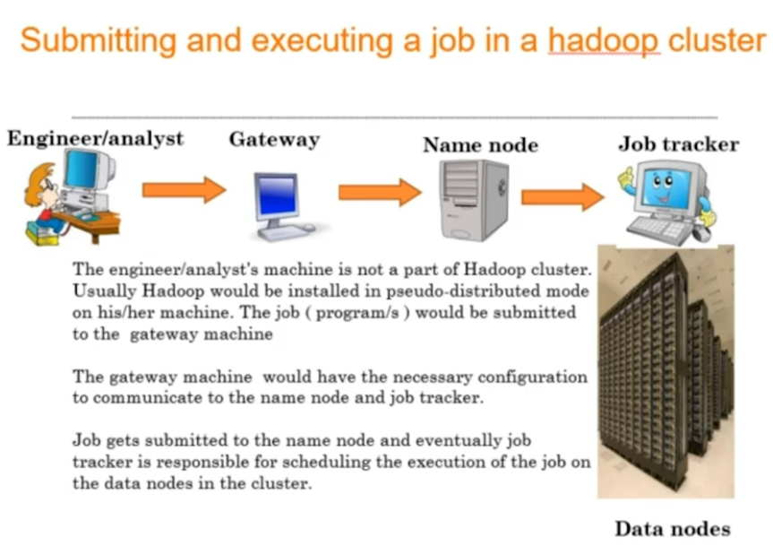

### Types of data
1. Structured data:
	- Data represented in tabular format
	- Ex: Databases
2. Semi-structured data:
	- Data which does not have formal data model tho have some structure
	- Ex: XML, HTML, Email
3. Unstructured data
	- Data which does not have predefied data model
	- Ex: Text, Image, Video

### Need for Big data:
- 90% of the data has been created in last 2 years alone
- 80% of the data is unstructured which are difficult to analyze
- Structured format limitations in handling large quantities
- Potential valuable data is dormant or discarded
- Manage and process huge amount of data cost effectively

### V's of Big data:
1. Volume
2. Velocity
3. Variety
4. Variablity
5. Value
6. Veracity : uncertainity | correctness due to ambiguity, inconsistency

### Usecase

### Challenges of Big data
- Store the sheer size of data
- Process huge data
- Handle vareity of data (semi-structured, unstructured)
- Scalability
- Cost

# Hadoop
#### Key terms
1. **Commodity hardware**: PCs used to make cluster
2. **Cluster/grid**: Interconnections of systems in a network
3. **Node**: A single instance of computer
4. **Distributed system**: A system consists of multiple autonomous computers that communicate through a computer network
5. **ASF**: Apache Software foundation
6. **HA**: High Avaliablity
7. **Hot Standby**: Uninterrupted fallover | if one node goes down another node replaces it instantaniously

### Hadoop Deployment Modes
Hadoop supports 3 configurations:
1. **Standalone mode**: All services works locally in single machine on a single JVM
2. **Psudo Distributed mode**: All services works locally in single machine but on different JVM
3. **Fully Distributed mode**: Each services runs in separate hardware. Used in production

>Services are namenode, secondary namenode, job tracker, datanode

### Functionality of Each components V1
##### 1. Master nodes
- **Name node**: Central file system manager
- **Secondary name node**: Data backup of name node (not hot standby)
- **Job tracker**: Central job scheduler

##### 2. Slave nodes
- **Data node**: Machine where files get stored and processed
- **Task tracker**: A software services which moniters state of job tracker

>Every slave node sends an heartbeat signal to master node every 3 second to state its alive

### Job in hadoop
- Job is some task submitted by the user to hadoop cluster
- A job is in form of program or collection of programs which needs to be executes
- Job has following attributes
	1. The actual programs
	2. Input data to the program. Can be files or no of files in directory
	3. Output directory where results are stored

### HADOOP core features
1. **HDFS (Hadoop Distributed File System)**: For data storage
2. **MapReduce Framework**: Compute in distributed environment

#### Submitting and executing the jobs

>Size of a block: Multiple of 64MB, minimum being 64MB

### Hadoop Hardware

>Default replication factor: 3

### Architecture of Hadoop

### Replica Placement Strategy
- Replica placement are rack aware. Namenode uses the network location when determining where to place block replicas.
- Tradeoffs: Reliability vs read/write bandwidth
- 
