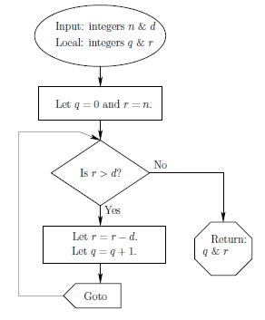

## DIVISIBILITY AND THE DIVISION ALGORITHM

#### Divisibility
> Notation -> |
> If 'b' is a divisor of 'a' then **b|a**
> Remainder is zero
```
13|182; -5|50; 17|0; 20|400
```

Properties:
* If a|1, then a = 1 or a = -1
* If a|b and b|a, then a = b or a = -b
* Any b != 0 divides 0
* if a|b and b|c, then a|c
```
11|66 and 66|198 => 11|198
```
* ==If b|g and b|h, then b|(mg + nh)==

#### Division Algorithm
Given an non-negative integer *a*, the divisor is *n* i.e. $a/n$
$$ a = qn + r \qquad 0 \le r \lt n; q = |a/n| $$
where,
a = dividend, n = divisor, q = quotient, r = remainder


## THE EUCLIDEAN ALGORITHM
- Is a simple procedure for determining **the GCD(Greatest Common Divisor)** of two positive integers
##### Algotithm:
1. Suppose you want to determine GCD of two numbers $a$, $b$. So, **gcd(a, b)** such that  $a \ge b \gt 0$. 
2. Dividing $a$ by $b$ is $a/b$:
$$ a = q_1b + r_1 \qquad 0 \le r_1 \lt n $$
3. if $r_1 = 0$, then $b$ is the GCD.
4. If $r_1 \ne 0$. Let us consider $x$ such that
$$ x|a \quad and \quad x|b $$
$$ x|a,\quad x|b \quad => \quad x|(ma + nb) $$
$$ x|(a - q_1b) \quad => \quad x|r_1 $$
So,
$$ x|a, \quad x|b, \quad x|r_1 $$
5. Take GCD of $b$ and $r_1$. i.e. gcd(b, r_1). 
6. Repeat the process until r = 0.

```python
def gcd(a, b):
    while b != 0:
        a, b = b, a % b
    return a
```




## MODULAR ARITHMETIC
##### Modulus
* Gives remainder

##### Properties of Congruences
1. $a=b \text{ mod } n$ if $n|(a-b)$
2. $a=b \text{ mod } n$ implies $b=a \text{ mod } n$
3. $a=b \text{ mod } n$ and $b=c \text{ mod } n$ imply $a=c \text{ mod } n$

##### Modular Arithemetic Operations
