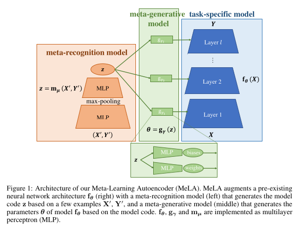

* single-task neural network with a **meta-recognition method** which learns succinet(clear, concise) model code via its **autoencoder structure**, using **few information** examples.	
* **Meta-Learning Autoencoder (MeLA)** framework
* MeLA adds the ability to identify influential training examples and predict with additiional data will be most valuable to acquire to improve model prediction.

## Introduction
* Focus on learning a series of prediction/regression models with continuous targets, where each class of problems has similar underlying mechanisms.
* MeLA consists of:
	1. **Learnable meta-recognition model:** Encoder
			- that can for each (unseen) task distill a few input-output examples into a model code vector parameterizing the task's funcitonal relationships
			- Discover and encode the important variations of functional mappings for different tasks. 
	2. **Learnable meta-generative model:** Decoder 
			- that maps this model code for the weight and bias parametes of a neural network implementing this function.
			- Decode the model codes to corresponding task-specific models with a common model generating network.
#### TODO not understood First point
* MeLA working:
	* MeLA does not create single good initalization ie single model for all task.
	* Instead, it takes few examples from each class and maps it into different models, which not only allows for more diverse model parametes tailored for each individual tasks, but also avoids the need for fine-tuning.
	
 * MeLA has following 3 important capabilities:
	1. **Augmented model recognition:**  ?? creates new model from pre-existing one ?? 
	2. **Influence identificaiton:** Identify which examples are most useful for determining the model.  (for example, a rectangle's vertices have far greater influence in determining its position and size than its inferior points).
	3. **Interactive learining:** MeLA can activey request new sample which maximize its ability to learn models.

## Methods
###### Meta-learning problem setup:
* Modeling a set of vector valued **function** $h_\alpha$ that **maps** a **m-dimensional input vector** $x$ into **n-dimensional output vector** $y$. 
$$ y = h_\alpha(x) $$
- Focus on regression problem where target $y belongs to R^n$ is continuous. eg modeling time series data
- Train a model f that predicts all output vectors from the corresponding input vectors to **minimize loss function** l that quantifies the prediction errors
- Meta-learning goal is to train an **ensemble** of training datasets to be able to  quickly learn from few examples

##### Meta-learning autoencoder architecture
-  Architecture of MeLA is defined by three vector-valued functions $f_\theta, g_\gamma \text{ and } m_\mu$, defined by parameterized vectors $\theta, \gamma, \mu$
- TODO not understood need pen and paper.

